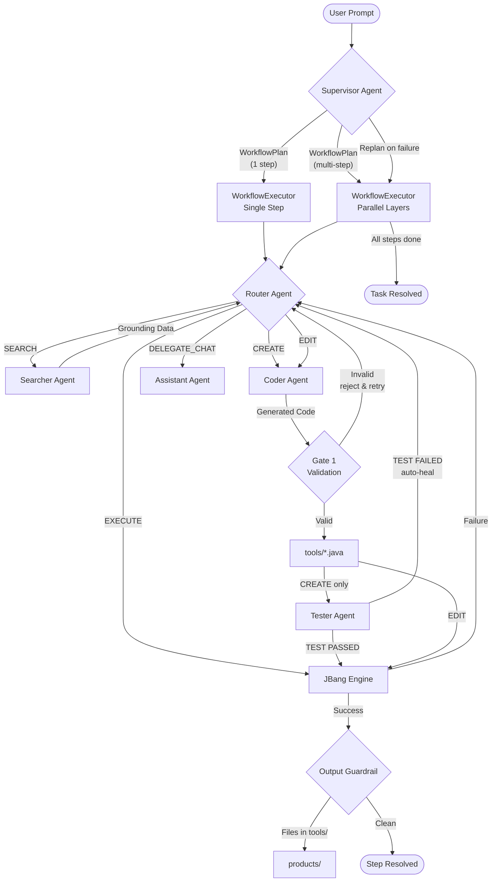

# JForge Agent

<p align="center">
  
  
  
</p>

<p align="center">
  <strong>The self-evolving agent that builds its own toolbox — and orchestrates it as a workflow.</strong>
</p>

---

JForge is a **two-layer orchestration engine**: a **Supervisor** decomposes your goal into a structured workflow plan, and a **Router** decides how to execute each step — forging new Java tools, reusing cached ones, searching the web, or answering conversationally. Complex multi-step tasks run automatically, with parallel execution and result chaining between steps.

---

## Table of Contents

1. [How It Works — 30-second Overview](#-how-it-works--30-second-overview)
2. [Installation](#-installation)
   - [1. Install Java 26+ via SDKMAN](#1-install-java-26-via-sdkman)
   - [2. Install JBang](#2-install-jbang)
   - [3. Get a Gemini API Key](#3-get-a-gemini-api-key)
   - [4. Clone & Run](#4-clone--run)
3. [Architecture](#-architecture)
   - [Two-Layer Orchestration](#two-layer-orchestration)
   - [Supervisor Agent](#supervisor-agent)
   - [Workflow Executor](#workflow-executor)
   - [The Six Agents](#the-six-agents)
   - [Workspace Layout](#workspace-layout)
   - [Guardrails](#guardrails)
   - [Safety & Security Layers](#safety--security-layers)
   - [Cognitive Garbage Collector](#cognitive-garbage-collector)
4. [CLI Options](#-cli-options)
5. [Usage & Example Prompts](#-usage--example-prompts)
6. [Troubleshooting](#-troubleshooting)

---

## How It Works — 30-second Overview



---

## Installation

### 1. Install Java 26+ via SDKMAN

[SDKMAN](https://sdkman.io) is the easiest way to manage JDK versions on Linux, macOS, and Windows (WSL/Git Bash).

**Install SDKMAN:**

```bash
curl -s "https://get.sdkman.io" | bash
source "$HOME/.sdkman/bin/sdkman-init.sh"
```

**Install Java 26 (or the latest available):**

```bash
# List available Java 26 builds
sdk list java | grep "26"

# Install the GraalVM or Temurin distribution (example):
sdk install java 26-tem

# Set it as default
sdk default java 26-tem

# Verify
java --version
# Expected: openjdk 26 ...
```

> **Windows users (native, not WSL):** Download the JDK 26 from [Adoptium](https://adoptium.net) and add it to your `PATH`. JBang works natively on Windows — no WSL required.

---

### 2. Install JBang

JBang lets you run `.java` files as if they were shell scripts — no `pom.xml`, no `build.gradle`, no compile step.

**Linux / macOS / WSL:**

```bash
curl -Ls https://sh.jbang.dev | bash -s - app setup
```

**Windows (PowerShell):**

```powershell
iex "& { $(iwr https://ps.jbang.dev) } app setup"
```

**Via SDKMAN (recommended if you already have it):**

```bash
sdk install jbang
```

**Verify:**

```bash
jbang --version
# Expected: JBang v0.x.x
```

---

### 3. Get a Gemini API Key

1. Go to [Google AI Studio](https://aistudio.google.com/app/apikey)
2. Sign in with a Google account
3. Click **"Create API Key"**
4. Copy the key

**Set the environment variable:**

```bash
# Linux / macOS / WSL — add to ~/.bashrc or ~/.zshrc for persistence:
export GEMINI_API_KEY="your-api-key-here"

# Windows (PowerShell) — permanent for current user:
[System.Environment]::SetEnvironmentVariable("GEMINI_API_KEY", "your-api-key-here", "User")

# Windows (Command Prompt) — current session only:
set GEMINI_API_KEY=your-api-key-here
```

> **Security note:** Never commit your API key to version control. JForge reads it exclusively from the environment variable — it is never written to disk or logged.

---

### 4. Clone & Run

```bash
# Clone the repository
git clone https://github.com/gazolla/JForgeAgent.git
cd JForgeAgent

# Run on Linux / macOS
jbang JForgeAgent.java

# Run on Windows (PowerShell or CMD)
jbang .\JForgeAgent.java
```

On first run, JBang will download all dependencies automatically (Google ADK, picocli, Gson, slf4j). This takes ~30 seconds once — subsequent runs are instant.

**Expected welcome screen:**

```
[LLM] Model: gemini-2.5-pro-preview | Agents: supervisor, router, coder, assistant, searcher, tester
Welcome to JForge V1.0 - Tool Orchestrator.
Available tools are cached in: /path/to/JForgeAgent/tools
Logs are recorded in:          /path/to/JForgeAgent/logs
Workspace [Products]:          /path/to/JForgeAgent/products
Workspace [Artifacts]:         /path/to/JForgeAgent/artifacts

🤖 What would you like to achieve? (or 'exit'/'quit'):
```

---

## Architecture

### Two-Layer Orchestration

Every user prompt passes through **two layers** before any work is done:

```
Layer 1 — SUPERVISOR:  What to do, in what order, with what dependencies?
Layer 2 — ROUTER:      How to achieve each step? (search, create, execute, chat)
```

This separation means the Supervisor never needs to know about APIs, tools, or code — it only plans the workflow. The Router never needs to know about the big picture — it handles one sub-goal at a time with full intelligence.

For simple requests (a single question or a single tool), the Supervisor generates a one-step plan and the Router handles it exactly as before. For complex tasks, the Supervisor generates a multi-step plan with dependencies and the WorkflowExecutor runs each step through the Router.

---

### Supervisor Agent

The Supervisor receives your goal and the list of currently cached tools, then returns a **WorkflowPlan** in JSON:

```json
{
  "goal": "Get weather for Southeast Brazilian cities and create a PDF summary",
  "steps": [
    { "id": "s1", "goal": "Get weather for Rio de Janeiro",    "dependsOn": [] },
    { "id": "s2", "goal": "Get weather for São Paulo",         "dependsOn": [] },
    { "id": "s3", "goal": "Get weather for Belo Horizonte",    "dependsOn": [] },
    { "id": "s4", "goal": "Create a PDF summary using: <<s1>> | <<s2>> | <<s3>>",
                  "dependsOn": ["s1", "s2", "s3"] }
  ]
}
```

**What the Supervisor decides:**
- How many steps are needed (one for simple tasks, many for complex workflows)
- Which steps depend on which others (`dependsOn`)
- What each step should achieve (`goal`) — using `<<stepId>>` to inject the output of a previous step

**What the Supervisor does NOT decide:**
- Whether to SEARCH, CREATE, EXECUTE, or DELEGATE_CHAT — that is the Router's job
- Which tool to use — the Router decides from the cache

The plan is saved to `logs/workflow_<timestamp>.json` for auditing. If a step fails and the Supervisor is asked to replan, each revised version is saved as `logs/workflow_<timestamp>_replan1.json`, etc.

**Fallback:** If the Supervisor fails to produce a valid plan (LLM error or malformed JSON), JForge falls back automatically to the direct Router loop — no interruption for the user.

---

### Workflow Executor

The WorkflowExecutor receives the plan and runs it:

1. **Topological sort** — groups steps into *layers* based on `dependsOn`. Steps with no mutual dependency share the same layer.
2. **Layer-by-layer execution** — each layer completes before the next starts.
3. **Parallel execution within a layer** — steps in the same layer run as VirtualThreads (Java 26), so independent tasks execute concurrently.
4. **Result chaining** — after each step, its output is stored and substituted into any `<<stepId>>` placeholder in later steps' goals.
5. **Replanning on failure** — if a step produces no output, the Supervisor is asked to replan (max 2 replans).

**Example execution trace for the weather PDF request:**

```
[SUPERVISOR] 4 steps planned for: Get weather for Southeast Brazilian cities and create a PDF
[EXECUTOR] Layer 1/2: [s1, s2, s3]          ← 3 steps run concurrently
  [STEP s1] → Get weather for Rio de Janeiro → EXECUTE: CityWeather.java "Rio de Janeiro"
  [STEP s2] → Get weather for Sao Paulo      → EXECUTE: CityWeather.java "Sao Paulo"
  [STEP s3] → Get weather for Belo Horizonte → EXECUTE: CityWeather.java "Belo Horizonte"
[EXECUTOR] Layer 2/2: [s4]
  [STEP s4] → Create a PDF using: rio: +26°C | sao: +5°C | belo: +22°C
            → EDIT: WeatherPdfGenerator.java  (Router edits with real data)
            → EXECUTE: WeatherPdfGenerator.java
[GUARDRAIL] Output file moved to products/: WeatherSummary.pdf
```

**LoopState fields** (per Router sub-loop, one per step):

| Field | Purpose |
|---|---|
| `taskResolved` | Signals the Router loop to exit cleanly |
| `lastError` | Holds the stack trace from a failed tool execution |
| `crashRetries` | Counts auto-heal attempts (max 2 before aborting) |
| `searchCount` | Limits web searches per step (max 3) |
| `ragContext` | Accumulates web search results as live knowledge |
| `cacheList` | Snapshot of tools on disk (lazy-loaded, invalidated after writes) |
| `stepResults` | Accumulated outputs keyed by step id — used for `<<stepId>>` chaining |

---

### The Six Agents

Each agent is a stateless `InMemoryRunner` wrapping a `LlmAgent` backed by Google Gemini. They share no memory — context is injected as text on every call.

#### Supervisor Agent — *The Planner*

Receives the user goal and the cached tool list. Returns a `WorkflowPlan` JSON defining sub-goals and their dependencies. Knows when a single step suffices (simple question, single tool) and when a multi-step workflow is needed (parallel data fetching, create then run, summarize multiple results).

Does **not** decide implementation details — that is the Router's domain.

#### Router Agent — *The Director*

The Router reads everything: the sub-goal from the Supervisor, the tool cache, the system clock, the RAG context, and any prior error. It returns **exactly one** of these five commands:

| Command | Meaning |
|---|---|
| `EXECUTE: ToolName.java [args...]` | Run an existing cached tool |
| `CREATE: <instruction>` | Forge a new tool from scratch |
| `EDIT: ToolName.java <changes>` | Modify an existing tool |
| `SEARCH: <query>` | Fetch live data using Google Search |
| `DELEGATE_CHAT` | Answer conversationally (no tool needed) |

The Router is aware of time (it knows today's date and time zone), so it uses `SEARCH` before answering factual questions like prices, news, or current events — never hallucinating.

#### Coder Agent — *The Forger*

The Coder receives a precise instruction (or the existing code + change request) and returns a structured response containing two mandatory sections:

```
//METADATA_START
{
  "name": "WeatherTool.java",
  "description": "Fetches current weather from wttr.in for a given city",
  "args": ["city name"]
}
//METADATA_END

//FILE: WeatherTool.java
//DEPS com.squareup.okhttp3:okhttp:4.12.0
... java code ...
```

The metadata is saved as `WeatherTool.meta.json` alongside the script. This JSON is what the Router reads when deciding whether an existing tool can fulfill a future request — making the cache semantically searchable, not just by filename.

The Coder is explicitly instructed to **never swallow exceptions** — tools must crash loudly so the orchestrator can detect failure and trigger auto-heal.

#### Searcher Agent — *The Researcher*

The Searcher is equipped with the `GoogleSearchTool`. It performs the actual web queries when requested by the Router. It returns a structured plain-text report focusing on:

- Technical API endpoints and documentation.
- Factual data points and dates.
- Direct sources and URLs for grounding.

This agent ensures that the system doesn't rely on hallucinations but on real-time indexed data.

#### Assistant Agent — *The Communicator*

When the Router decides no code is needed, the Assistant takes over. It receives your original prompt, the current system clock, the list of available cached tools, and any RAG context gathered by prior `SEARCH` commands. It responds in clean Markdown, grounded in real data.

#### Tester Agent — *The Validator*

After every successful CREATE, the Tester generates a single safe test invocation and runs it immediately. No user interaction required.

- **Pass** → pipeline continues normally to the final EXECUTE with the user's real arguments.
- **Fail** → the error output becomes `state.lastError`; the Router issues `EDIT` on the next iteration to auto-heal before the tool ever reaches the user.

Use `--skip-test` to bypass this step for tools that open GUI windows or require physical hardware.

---

### Code Validation

Before any generated code is written to disk, JForge runs four fast structural checks:

| Check | What it catches |
|---|---|
| Blank body | Coder returned an empty code block |
| Missing `//DEPS` | JBang dependency directive absent |
| Missing `class` / `void main` | Incomplete Java structure |
| Leaked markdown fences | LLM ignored the no-markdown rule |

If any check fails, the file is **never written**. `state.lastError` is set with a clear message and the Router retries with `EDIT` on the next iteration — without polluting the `tools/` directory with broken files.

---

### Workspace Layout

JForge creates and manages five directories relative to where you run it:

```
./
├── tools/          ← Generated .java scripts + .meta.json schemas
│   ├── WeatherTool.java
│   ├── WeatherTool.meta.json
│   └── ...
├── logs/           ← Session logs (last 3 retained) + workflow plans
│   ├── session_20260410_143022.log
│   ├── workflow_20260410_143022.json          ← WorkflowPlan (initial)
│   └── workflow_20260410_143022_replan1.json  ← WorkflowPlan after replan
├── memory/         ← Persistent conversation memory (one entry per line)
│   └── context.json
├── artifacts/      ← Temporary data written by tools (extractions, raw downloads)
└── products/       ← Final output files for the user (reports, PDFs, exports)
```

Tools are instructed to use the **absolute paths** of `artifacts/` and `products/` — not relative paths — ensuring they work correctly regardless of the directory a tool's process is spawned from.

---

### Guardrails

JForge has two active guardrails that correct common problems automatically — no user intervention required.

#### Guardrail 1 — DELEGATE_CHAT Redirect

If the Router mis-routes to `DELEGATE_CHAT` but the response mentions the name of a cached tool, JForge detects the mis-route and forces re-routing to `EXECUTE`:

```
[GUARDRAIL] DELEGATE_CHAT mentioned 'WeatherTool.java' — overriding to EXECUTE
```

#### Guardrail 2 — Output File Relocation

Tools run with `tools/` as their working directory. If a generated tool saves an output file (PDF, CSV, image, etc.) using a relative path or a malformed absolute path, it lands inside `tools/` instead of `products/`. After every tool execution, JForge scans `tools/` and moves any stray output files to `products/` automatically:

```
[GUARDRAIL] Output file moved to products/: WeatherSummary.pdf
```

The guardrail also removes stray subdirectories left by path-construction bugs (e.g. directories whose names contain literal quote characters). It correctly ignores:
- `.java` and `.meta.json` files (legitimate tool files)
- Hidden files: `.DS_Store`, `.gitignore`, etc. (macOS/Linux)
- Windows system files: `Thumbs.db`, `desktop.ini`, etc.

---

### Safety & Security Layers

JForge executes LLM-generated code on your machine. Several layers of defense are active:

| Layer | Mechanism |
|---|---|
| **Name validation** | Tool names must match `[A-Za-z0-9_\-]+\.java` — no path separators, no extension tricks |
| **Path containment** | Resolved tool path must remain inside `tools/` after normalization |
| **Symlink rejection** | Symbolic links inside `tools/` are rejected at execution time |
| **Arg sanitization** | LLM-supplied arguments are filtered against a blocklist: `-D`, `-X`, `--classpath`, `--deps`, `--jvm-options`, `--`, `-agent`, `--source` |
| **Process timeout** | Tools are killed after 120 seconds (`MAX_TOOL_TIMEOUT_SECONDS`) |
| **LLM timeout** | Agent API calls time out after 60 seconds via `CompletableFuture.orTimeout()` |
| **Loop guard** | Each Router sub-loop aborts after 10 iterations regardless of state |
| **Replan limit** | The Supervisor may replan at most 2 times per user request |
| **Search guard** | Maximum 3 web searches per Router sub-loop |
| **Crash limit** | Auto-heal retries are capped at 2 attempts per step |

---

### Persistent Memory

JForge automatically saves conversation history to `memory/context.json` between sessions. On the next startup, the Supervisor and Router read the last interactions as `[Recent Chat History]`, allowing the system to:

- Recognize tools it built in a previous session without rebuilding them
- Avoid repeating web searches already performed
- Maintain conversational continuity across restarts

The memory file stores entries in plain text (one per line) and is updated after every interaction. It is capped at 20 entries — the oldest are evicted when full. To reset memory to a clean state, simply delete `memory/context.json`.

---

### Cognitive Garbage Collector

JForge manages its own tool cache autonomously — no manual cleanup needed.

The GC runs at most **once per minute** (throttled to avoid redundant filesystem scans) and applies two eviction policies in order:

1. **Age-based eviction:** Tools not accessed for more than `--tool-age-days` (default: 30 days) are deleted along with their `.meta.json` companion.
2. **Count-based eviction:** If more than `--max-tools` (default: 10) tools remain after age eviction, the least recently used ones are removed until the count is within the limit.

This keeps the cache small and semantically fresh — the Router always sees tools that are relevant to recent usage patterns.

---

## CLI Options

```bash
jbang JForgeAgent.java [OPTIONS]
```

| Option | Default | Description |
|---|---|---|
| `--model <model>` | — | Override Gemini model for **all** agents (disables per-agent defaults) |
| `--supervisor-model` | `gemini-2.5-pro` | Model for the Supervisor agent |
| `--router-model` | `gemini-2.5-pro` | Model for the Router agent |
| `--coder-model` | `gemini-2.5-pro` | Model for the Coder agent |
| `--assistant-model` | `gemini-2.5-flash` | Model for the Assistant agent |
| `--searcher-model` | `gemini-2.5-flash` | Model for the Searcher agent |
| `--tester-model` | `gemini-2.5-flash` | Model for the Tester agent |
| `--max-tools <n>` | `10` | Maximum cached tools before GC count-eviction |
| `--tool-age-days <n>` | `30` | Days of inactivity before a tool is eligible for deletion |
| `--prompt <text>` | — | Run a single prompt non-interactively and exit (CI/CD mode) |
| `--silent` | `false` | Suppress all status/decorative output; print only the final result (for pipe/MCP/A2A use) |
| `--skip-test` | `false` | Skip the auto-test after CREATE (use for GUI/Swing or hardware-dependent tools) |
| `-V`, `--version` | — | Print version and exit |
| `-h`, `--help` | — | Print help and exit |

By default, agents that require deep reasoning (Supervisor, Router, Coder) use `gemini-2.5-pro`, while agents with simpler tasks (Assistant, Searcher, Tester) use `gemini-2.5-flash`.

**Examples:**

```bash
# Default run — per-agent model assignment is automatic
jbang JForgeAgent.java

# Force all agents to use the same model (e.g. for testing)
jbang JForgeAgent.java --model gemini-2.0-flash

# Override only the Coder to a newer model, keep others as default
jbang JForgeAgent.java --coder-model gemini-2.5-pro

# Aggressive GC: delete tools unused for more than 7 days, keep max 5
jbang JForgeAgent.java --tool-age-days 7 --max-tools 5

# Run a single prompt without opening an interactive session
jbang JForgeAgent.java --prompt "What is the current price of Bitcoin?"

# Machine-readable output for piping
jbang JForgeAgent.java --silent --prompt "Fetch BTCUSDT price as JSON" | jq '.price'
```

---

## Non-Interactive Mode

JForge can run a single prompt without an interactive terminal — ideal for shell scripts, CI/CD pipelines, and automation:

```bash
# Ask a question non-interactively
jbang JForgeAgent.java --prompt "What is the current price of Bitcoin?"

# Multi-step workflow non-interactively
jbang JForgeAgent.java --prompt "Get weather for London, Paris and Berlin and summarize"

# Use inside a shell script
jbang JForgeAgent.java --prompt "Fetch the ISS location and save the map to products/"
```

When `--prompt` is provided, JForge:

1. Initializes all six agents normally
2. Loads persistent memory from previous sessions
3. Runs the Supervisor to generate a WorkflowPlan
4. Executes the plan through the WorkflowExecutor + Router loops
5. Prints the result and exits with code `0`

### Silent Mode — machine-readable output

Add `--silent` to suppress all status messages, agent names, and decorative output. Only the final result is printed to stdout — no ANSI codes, no brackets, no banners:

```bash
# Output only the final result — pipe-friendly
jbang JForgeAgent.java --silent --prompt "What is the current Bitcoin price?"

# Capture the result in a shell variable
RESULT=$(jbang JForgeAgent.java --silent --prompt "Summarize the latest Java 26 features")
echo "$RESULT"
```

---

## Usage & Example Prompts

Once running, just type your request at the prompt. The Supervisor handles planning, the Router handles execution.

---

### Simple Questions & Live Data

For single-step tasks, the Supervisor generates one step and the Router handles it entirely.

```
What is the current price of Bitcoin in USD?
```

> Supervisor → 1 step → Router → `SEARCH` → `DELEGATE_CHAT` with RAG context

```
Who won the last FIFA World Cup and what was the final score?
```

> Supervisor → 1 step → Router → `SEARCH` → `DELEGATE_CHAT`

---

### Forging New Tools

```
Create a tool that fetches the current weather for any city using wttr.in
```

> Supervisor → 1 step → Router → `CREATE: WeatherTool.java` → `EXECUTE: WeatherTool.java "London"`

```
Build a currency converter that uses the Frankfurter API to convert amounts between any two currencies
```

> Supervisor → 1 step → Router → `SEARCH` → `CREATE: CurrencyConverter.java` → `EXECUTE`

```
Create a tool using the ZXing library that generates a QR code PNG from any text I give it and saves it to the products folder
```

> Supervisor → 1 step → Router → `CREATE: QRCodeGen.java` → `EXECUTE` → Guardrail moves `qrcode.png` to `products/`

---

### Multi-Step Workflows

These requests trigger the Supervisor to generate a multi-step plan.

**Parallel data collection + summary:**

```
Get the current weather for London, Tokyo and New York and write a comparison summary
```

```
[SUPERVISOR] 4 steps planned
[EXECUTOR] Layer 1/2: [s1, s2, s3]   ← 3 cities fetched in parallel
  [STEP s1] → weather London   → EXECUTE: WeatherTool.java "London"
  [STEP s2] → weather Tokyo    → EXECUTE: WeatherTool.java "Tokyo"
  [STEP s3] → weather New York → EXECUTE: WeatherTool.java "New York"
[EXECUTOR] Layer 2/2: [s4]
  [STEP s4] → summarize <<s1>> | <<s2>> | <<s3>> → DELEGATE_CHAT
```

**Create once, run in parallel:**

```
Pesquise o clima de Rio de Janeiro, São Paulo e Belo Horizonte e crie um PDF com o resumo
```

```
[SUPERVISOR] 4 steps planned
[EXECUTOR] Layer 1/2: [s1, s2, s3]   ← all 3 fetched in parallel
[EXECUTOR] Layer 2/2: [s4]
  [STEP s4] → Create PDF with: rio +26°C | sao +5°C | belo +22°C
            → EDIT: WeatherPdfGenerator.java  (updates data)
            → EXECUTE: WeatherPdfGenerator.java
[GUARDRAIL] Output file moved to products/: WeatherSummary.pdf ✓
```

**Search → create → run chain:**

```
Find a free DNS benchmark API and build a tool that measures latency for the top 5 public DNS servers
```

```
[SUPERVISOR] 3 steps planned
[EXECUTOR] Layer 1/3: [s1]  → SEARCH: free DNS benchmark / public DNS server IPs
[EXECUTOR] Layer 2/3: [s2]  → CREATE: DnsBenchmark.java using <<s1>>
[EXECUTOR] Layer 3/3: [s3]  → EXECUTE: DnsBenchmark.java
```

---

### Editing Existing Tools

```
Update the weather tool to also show wind speed and humidity, not just temperature
```

> Supervisor → 1 step → Router → `EDIT: WeatherTool.java "Add wind speed and humidity"`

```
The currency converter only does one conversion. Make it accept a list of target currencies and show all at once
```

> Supervisor → 1 step → Router → `EDIT: CurrencyConverter.java "Accept multiple target currencies"`

---

### Reusing Cached Tools

After a tool is built, the Supervisor sees it in the cache and generates steps that target it directly. The Router chooses `EXECUTE` without rebuilding.

```
# After building WeatherTool.java:
What's the weather in Tokyo?
```

> Supervisor → 1 step → Router reads cache → `EXECUTE: WeatherTool.java "Tokyo"`

```
# Multi-city request with existing tool:
Show me the weather for all G7 capitals
```

> Supervisor → 7 parallel EXECUTE steps (one per capital) + 1 summary step

---

### GUI & Visualization Tools

```
Build a Swing app that shows a live analog clock with the current local time, updating every second
```

> Supervisor → 1 step → Router → `CREATE: AnalogClock.java` → `EXECUTE` — opens a desktop window

```
Create a bar chart using the XChart library that plots the monthly average temperature for São Paulo
```

> Supervisor → 1 step → Router → `CREATE: TemperatureChart.java` → opens chart window

Use `--skip-test` for GUI/Swing tools since the auto-test can't validate windowed output.

---

### Auto-Heal in Action

If a generated tool crashes, the Router repairs it automatically — within the same step:

```
[CODER] Developing new Tool -> GitHubTrending.java
[EXECUTE] EXECUTE: GitHubTrending.java
Exception in thread "main" java.io.IOException: Server returned HTTP response code: 403
Tool Execution Failed. Returning trace to Router for analysis...
[CODER] Modifying existing tool -> GitHubTrending.java
        Fix: Add proper User-Agent header to bypass GitHub anonymous request blocking
[EXECUTE] EXECUTE: GitHubTrending.java
1. awesome-llm-apps 42.3k ✓
```

---

### Workflow Audit

Every plan generated by the Supervisor is saved in `logs/`:

```bash
cat logs/workflow_20260410_143022.json
```

```json
{
  "goal": "Get weather for Southeast Brazilian cities and create PDF",
  "steps": [
    {"id":"s1","goal":"Get weather for Rio de Janeiro","dependsOn":[]},
    {"id":"s2","goal":"Get weather for Sao Paulo","dependsOn":[]},
    {"id":"s3","goal":"Get weather for Belo Horizonte","dependsOn":[]},
    {"id":"s4","goal":"Create PDF summary using: <<s1>> | <<s2>> | <<s3>>","dependsOn":["s1","s2","s3"]}
  ]
}
```

If replanning occurred, each revised plan is saved with a `_replan1`, `_replan2` suffix alongside the session log.

---

## 🔧 Troubleshooting

| Symptom | Likely Cause | Fix |
|---|---|---|
| `Please set the GEMINI_API_KEY` | API key not set | Export `GEMINI_API_KEY` in your shell profile and restart the terminal |
| `Interactive console is not supported` | Running inside an IDE terminal or piped input | Run in a real terminal (Windows Terminal, iTerm2, Bash) |
| `[LLM ERROR] Context variable not found` | Template variable in agent instruction | Fixed in current version — update to latest |
| `[SUPERVISOR] No valid plan produced — falling back to Router mode` | Supervisor LLM error or malformed JSON response | Automatic fallback; if persistent, try rephrasing the prompt |
| `[TIMEOUT] Tool exceeded 120s` | Tool has an infinite loop or blocking network call | Ask JForge: *"Edit the tool to add a 10-second HTTP timeout"* |
| `[LLM ERROR] LLM API call failed` | Network issue or Gemini quota exceeded | Check your internet and quota at [Google AI Studio](https://aistudio.google.com) |
| `[LOOP GUARD] Maximum iterations reached` | Router is stuck in a SEARCH/CREATE cycle | Rephrase your prompt with more specific instructions |
| `[STEP sN] produced no output` | LLM timeout or loop-guard abort on a workflow step | Supervisor will automatically replan (max 2 attempts) |
| `[GUARDRAIL] Output file moved to products/: X` | Tool saved output to `tools/` instead of `products/` | Normal — guardrail handled it; file is in `products/` |
| `[TEST FAILED] Tool failed validation` | Newly created tool crashed during auto-test | Auto-heal activates automatically; use `--skip-test` for GUI or hardware tools |
| `[VALIDATION] Validation failed` | LLM generated malformed code | JForge retries automatically; if it persists, try rephrasing |
| `[GUARDRAIL] DELEGATE_CHAT mentioned 'X.java' — overriding to EXECUTE` | Router mis-routed when a cached tool should have run | Automatic — guardrail forces re-routing to `EXECUTE` |
| Tool compiles but produces wrong output | LLM logic error | Ask: *"The result was wrong. Fix [ToolName.java] to correctly handle [case]"* |

---

## Requirements Summary

| Requirement | Version | Notes |
|---|---|---|
| Java | 26+ | Install via SDKMAN: `sdk install java 26-tem` |
| JBang | Latest | Install via SDKMAN: `sdk install jbang` |
| Gemini API Key | — | Free tier available at [aistudio.google.com](https://aistudio.google.com) |
| Internet access | — | Required for Gemini API and web search |
| Disk space | ~50 MB | JBang dependency cache on first run |

**JBang Dependencies (auto-resolved):**

| Dependency | Version | Purpose |
|---|---|---|
| `com.google.adk:google-adk` | `1.0.0-rc.1` | LLM agents + Google Search tool |
| `info.picocli:picocli` | `4.7.5` | CLI parsing and ANSI output |
| `com.google.code.gson:gson` | `2.10.1` | WorkflowPlan JSON parsing |
| `org.slf4j:slf4j-simple` | `2.0.12` | Logging backend |

---

*JForge V1.0 — Built with [Google ADK](https://github.com/google/adk-java), [JBang](https://jbang.dev), [picocli](https://picocli.info) and [Gson](https://github.com/google/gson).*
