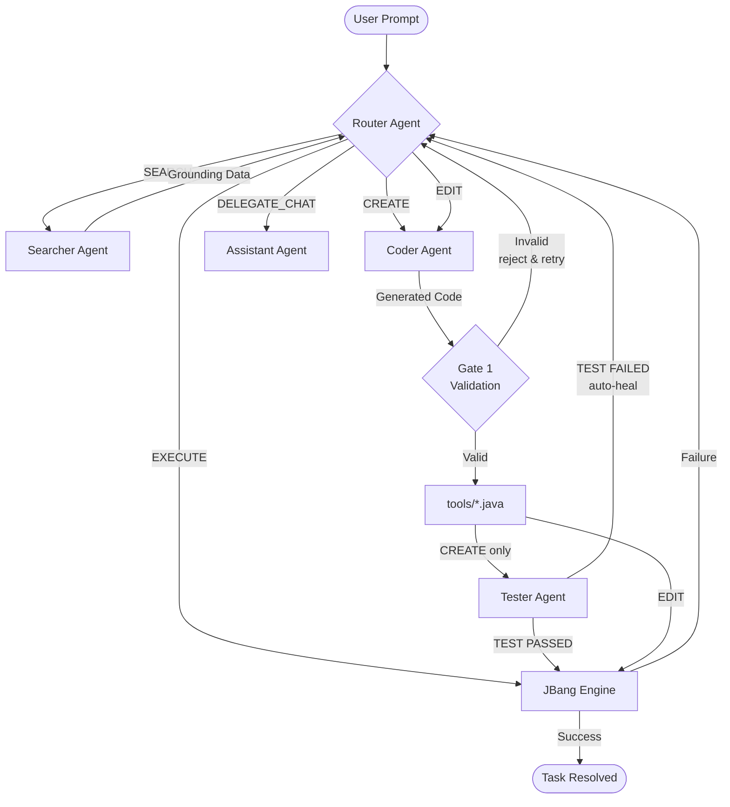

# JForge Agent

<p align="center">
  
  
  
</p>

<p align="center">
  <strong>The self-evolving agent that builds its own toolbox on the fly.</strong>
</p>

---

JForge is an **orchestration engine**: you describe what you want in plain English, and JForge decides whether to forge a new Java tool from scratch, reuse a cached one, search the web for live data, or simply answer you conversationally.

---

## Table of Contents

1. [How It Works — 30-second Overview](#-how-it-works--30-second-overview)
2. [Installation](#-installation)
   - [1. Install Java 26+ via SDKMAN](#1-install-java-26-via-sdkman)
   - [2. Install JBang](#2-install-jbang)
   - [3. Get a Gemini API Key](#3-get-a-gemini-api-key)
   - [4. Clone & Run](#4-clone--run)
3. [Architecture](#-architecture)
   - [The Orchestration Loop](#the-orchestration-loop)
   - [The Five Agents](#the-five-agents)
   - [Workspace Layout](#workspace-layout)
   - [Safety & Security Layers](#safety--security-layers)
   - [Cognitive Garbage Collector](#cognitive-garbage-collector)
4. [CLI Options](#-cli-options)
5. [Usage & Example Prompts](#-usage--example-prompts)
6. [Troubleshooting](#-troubleshooting)

---

## How It Works — 30-second Overview



---

## Installation

### 1. Install Java 26+ via SDKMAN

[SDKMAN](https://sdkman.io) is the easiest way to manage JDK versions on Linux, macOS, and Windows (WSL/Git Bash).

**Install SDKMAN:**

```bash
curl -s "https://get.sdkman.io" | bash
source "$HOME/.sdkman/bin/sdkman-init.sh"
```

**Install Java 26 (or the latest available):**

```bash
# List available Java 26 builds
sdk list java | grep "26"

# Install the GraalVM or Temurin distribution (example):
sdk install java 26-tem

# Set it as default
sdk default java 26-tem

# Verify
java --version
# Expected: openjdk 26 ...
```

> **Windows users (native, not WSL):** Download the JDK 26 from [Adoptium](https://adoptium.net) and add it to your `PATH`. JBang works natively on Windows — no WSL required.

---

### 2. Install JBang

JBang lets you run `.java` files as if they were shell scripts — no `pom.xml`, no `build.gradle`, no compile step.

**Linux / macOS / WSL:**

```bash
curl -Ls https://sh.jbang.dev | bash -s - app setup
```

**Windows (PowerShell):**

```powershell
iex "& { $(iwr https://ps.jbang.dev) } app setup"
```

**Via SDKMAN (recommended if you already have it):**

```bash
sdk install jbang
```

**Verify:**

```bash
jbang --version
# Expected: JBang v0.x.x
```

---

### 3. Get a Gemini API Key

1. Go to [Google AI Studio](https://aistudio.google.com/app/apikey)
2. Sign in with a Google account
3. Click **"Create API Key"**
4. Copy the key

**Set the environment variable:**

```bash
# Linux / macOS / WSL — add to ~/.bashrc or ~/.zshrc for persistence:
export GEMINI_API_KEY="your-api-key-here"

# Windows (PowerShell) — permanent for current user:
[System.Environment]::SetEnvironmentVariable("GEMINI_API_KEY", "your-api-key-here", "User")

# Windows (Command Prompt) — current session only:
set GEMINI_API_KEY=your-api-key-here
```

> **Security note:** Never commit your API key to version control. JForge reads it exclusively from the environment variable — it is never written to disk or logged.

---

### 4. Clone & Run

```bash
# Clone the repository
git clone https://github.com/your-org/JForgeAgent.git
cd JForgeAgent

# Run on Linux / macOS
jbang JForgeAgent.java

# Run on Windows (PowerShell or CMD)
jbang .\JForgeAgent.java
```

On first run, JBang will download all dependencies automatically (Google ADK, picocli, jsoup, slf4j). This takes ~30 seconds once — subsequent runs are instant.

**Expected welcome screen:**

```
Welcome to JForge V1.0 - Tool Orchestrator.
Available tools are cached in: C:\...\tools
Logs are recorded in:          C:\...\logs
Workspace [Products]:          C:\...\products
Workspace [Artifacts]:         C:\...\artifacts

What would you like to achieve? (or 'exit'/'quit'):
```

---

## Architecture

### The Orchestration Loop

Every user prompt enters a **stateful orchestration loop** that runs up to 10 iterations before timing out. The loop carries a `LoopState` object through each iteration, tracking:

| Field | Purpose |
|---|---|
| `taskResolved` | Signals the loop to exit cleanly |
| `lastError` | Holds the stack trace from a failed tool execution |
| `crashRetries` | Counts auto-heal attempts (max 2 before aborting) |
| `searchCount` | Limits web searches per demand (max 3) |
| `ragContext` | Accumulates web search results as live knowledge |
| `cacheList` | Snapshot of tools on disk (lazy-loaded, invalidated after writes) |

Each iteration calls the **Router Agent**, which reads the full state — including the workspace topology, system clock, cached tool metadata, RAG context, and the last error — and returns exactly one command.

```
Iteration 1:  SEARCH: "openweathermap free API endpoint"
Iteration 2:  CREATE: "Write a weather tool using the API found in RAG context"
Iteration 3:  EXECUTE: WeatherTool.java "São Paulo"
              → exit code 0, task resolved
```

If the tool crashes (non-zero exit or `Exception in thread` on stdout), the error trace is fed back into the loop and the Coder Agent is instructed to fix it — **without any user intervention**.

### The Five Agents

Each agent is a stateless `InMemoryRunner` wrapping a `LlmAgent` backed by Google Gemini. They share no memory — context is injected as text on every call.

#### Router Agent — *The Director*

The Router reads everything: your intent, the tool cache, the system clock, the RAG context, and any prior error. It returns **exactly one** of these five commands:

| Command | Meaning |
|---|---|
| `EXECUTE: ToolName.java [args...]` | Run an existing cached tool |
| `CREATE: <instruction>` | Forge a new tool from scratch |
| `EDIT: ToolName.java <changes>` | Modify an existing tool |
| `SEARCH: <query>` | Fetch live data using Google Search |
| `DELEGATE_CHAT` | Answer conversationally (no tool needed) |

The Router is aware of time (it knows today's date and time zone), so it uses `SEARCH` before answering factual questions like prices, news, or current events — never hallucinating.

#### Coder Agent — *The Forger*

The Coder receives a precise instruction (or the existing code + change request) and returns a structured response containing two mandatory sections:

```
//METADATA_START
{
  "name": "WeatherTool.java",
  "description": "Fetches current weather from wttr.in for a given city",
  "args": ["city name"]
}
//METADATA_END

//FILE: WeatherTool.java
//DEPS com.squareup.okhttp3:okhttp:4.12.0
... java code ...
```

The metadata is saved as `WeatherTool.meta.json` alongside the script. This JSON is what the Router reads when deciding whether an existing tool can fulfill a future request — making the cache semantically searchable, not just by filename.

The Coder is explicitly instructed to **never swallow exceptions** — tools must crash loudly so the orchestrator can detect failure and trigger auto-heal.

#### Searcher Agent — *The Researcher*

The Searcher is equipped with the `GoogleSearchTool`. It performs the actual web queries when requested by the Router. It returns a structured plain-text report focusing on:

- Technical API endpoints and documentation.
- Factual data points and dates.
- Direct sources and URLs for grounding.

This agent ensures that the system doesn't rely on hallucinations but on real-time indexed data.

#### Assistant Agent — *The Communicator*

When the Router decides no code is needed, the Assistant takes over. It receives:

- Your original prompt
- The current system clock
- The list of available cached tools
- Any RAG context gathered by prior `SEARCH` commands

It responds in clean Markdown, grounded in real data — not in stale training knowledge.

#### Tester Agent — *The Validator*

After every successful CREATE, the Tester generates a single safe test invocation and runs it immediately. No user interaction required.

- **Pass** → pipeline continues normally to the final EXECUTE with the user's real arguments.
- **Fail** → the error output becomes `state.lastError`; the Router issues `EDIT` on the next iteration to auto-heal before the tool ever reaches the user.

Use `--skip-test` to bypass this step for tools that open GUI windows or require physical hardware.

---

### Code Validation

Before any generated code is written to disk, JForge runs four fast structural checks:

| Check | What it catches |
|---|---|
| Blank body | Coder returned an empty code block |
| Missing `//DEPS` | JBang dependency directive absent |
| Missing `class` / `void main` | Incomplete Java structure |
| Leaked markdown fences | LLM ignored the no-markdown rule |

If any check fails, the file is **never written**. `state.lastError` is set with a clear message and the Router retries with `EDIT` on the next iteration — without polluting the `tools/` directory with broken files.

---

### Workspace Layout

JForge creates and manages four directories relative to where you run it:

```
./
├── tools/          ← Generated .java scripts + .meta.json schemas
│   ├── WeatherTool.java
│   ├── WeatherTool.meta.json
│   └── ...
├── logs/           ← Session logs (last 3 sessions retained)
│   └── session_20260408_143022.log
├── memory/         ← Persistent conversation memory (one entry per line)
│   └── context.json
├── artifacts/      ← Temporary data written by tools (extractions, raw downloads)
└── products/       ← Final output files for the user (reports, PDFs, exports)
```

Tools are instructed to use the **absolute paths** of `artifacts/` and `products/` — not relative paths — ensuring they work correctly regardless of the directory a tool's process is spawned from.

---

### Safety & Security Layers

JForge executes LLM-generated code on your machine. Several layers of defense are active:

| Layer | Mechanism |
|---|---|
| **Name validation** | Tool names must match `[A-Za-z0-9_\-]+\.java` — no path separators, no extensions tricks |
| **Path containment** | Resolved tool path must remain inside `tools/` after normalization |
| **Symlink rejection** | Symbolic links inside `tools/` are rejected at execution time |
| **Arg sanitization** | LLM-supplied arguments are filtered against a blocklist: `-D`, `-X`, `--classpath`, `--deps`, `--jvm-options`, `--`, `-agent`, `--source` |
| **Process timeout** | Tools are killed after 120 seconds (`MAX_TOOL_TIMEOUT_SECONDS`) |
| **LLM timeout** | Agent API calls time out after 60 seconds via `CompletableFuture.orTimeout()` |
| **Loop guard** | The orchestration loop aborts after 10 iterations regardless of state |
| **Search guard** | Maximum 3 web searches per user demand |
| **Crash limit** | Auto-heal retries are capped at 2 attempts per demand |

---

### Persistent Memory

JForge automatically saves conversation history to `memory/context.json` between sessions. On the next startup, the Router reads the last interactions as `[Recent Chat History]`, allowing it to:

- Recognize tools it built in a previous session without rebuilding them
- Avoid repeating web searches already performed
- Maintain conversational continuity across restarts

The memory file stores entries in plain text (one per line) and is updated after every interaction. It is capped at 20 entries — the oldest are evicted when full. To reset memory to a clean state, simply delete `memory/context.json`.

---

### Cognitive Garbage Collector

JForge manages its own tool cache autonomously — no manual cleanup needed.

The GC runs at most **once per minute** (throttled to avoid redundant filesystem scans) and applies two eviction policies in order:

1. **Age-based eviction:** Tools not accessed for more than `--tool-age-days` (default: 30 days) are deleted along with their `.meta.json` companion.
2. **Count-based eviction:** If more than `--max-tools` (default: 10) tools remain after age eviction, the least recently used ones are removed until the count is within the limit.

This keeps the cache small and semantically fresh — the Router always sees tools that are relevant to recent usage patterns.

---

## CLI Options

```bash
jbang JForgeAgent.java [OPTIONS]
```

| Option | Default | Description |
|---|---|---|
| `--model <model>` | `gemini-3-pro-preview` | Gemini model used by all three agents |
| `--max-tools <n>` | `10` | Maximum cached tools before GC count-eviction |
| `--tool-age-days <n>` | `30` | Days of inactivity before a tool is eligible for deletion |
| `--prompt <text>` | — | Run a single prompt non-interactively and exit (CI/CD mode) |
| `--silent` | `false` | Suppress all status/decorative output; print only the final result (for pipe/MCP/A2A use) |
| `--skip-test` | `false` | Skip the auto-test after CREATE (use for GUI/Swing or hardware-dependent tools) |
| `-V`, `--version` | — | Print version and exit |
| `-h`, `--help` | — | Print help and exit |

**Examples:**

```bash
# Use a faster model and keep up to 20 tools
jbang .\JForgeAgent.java --model gemini-2.0-flash --max-tools 20

# Aggressive GC: delete tools unused for more than 7 days, keep max 5
jbang .\JForgeAgent.java --tool-age-days 7 --max-tools 5

# Use the most capable model for complex engineering tasks
jbang .\JForgeAgent.java --model gemini-3-pro-preview

# Run a single prompt without opening an interactive session
jbang .\JForgeAgent.java --prompt "What is the current price of Bitcoin?"
```

---

## Non-Interactive Mode

JForge can run a single prompt without an interactive terminal — ideal for shell scripts, CI/CD pipelines, and automation:

```bash
# Ask a question non-interactively
jbang JForgeAgent.java --prompt "What is the current price of Bitcoin?"

# Use inside a shell script
jbang JForgeAgent.java --prompt "Fetch the ISS location and save the map to products/"

# Combine with other CLI options
jbang JForgeAgent.java --model gemini-2.0-flash --prompt "List my Downloads folder"
```

When `--prompt` is provided, JForge:

1. Initializes all agents normally
2. Loads persistent memory from previous sessions
3. Executes the prompt through the full orchestration loop (including tool creation, search, and auto-heal)
4. Prints the result and exits with code `0`

> **Note:** If `--prompt` is not set and no interactive terminal is available, JForge exits with an error as before.

### Silent Mode — machine-readable output

Add `--silent` to suppress all status messages, agent names, and decorative output. Only the final result is printed to stdout — no ANSI codes, no brackets, no banners. Ideal for piping output into other tools, MCP integrations, or A2A agents:

```bash
# Output only the final result — pipe-friendly
jbang JForgeAgent.java --silent --prompt "What is the current Bitcoin price?"

# Capture the result in a shell variable
RESULT=$(jbang JForgeAgent.java --silent --prompt "Summarize the latest Java 26 features")
echo "$RESULT"

# Combine with jq if the tool produces JSON output
jbang JForgeAgent.java --silent --prompt "Fetch BTCUSDT price as JSON" | jq '.price'
```

> **Tip:** `--silent` and `--prompt` are designed to work together. Interactive mode ignores `--silent` (there would be nothing left to see).

---

## Usage & Example Prompts

Once running, just type your request at the prompt. The orchestrator handles everything else.

---

### Live Data & Factual Questions

JForge always searches the web before answering time-sensitive questions — it never makes up current data.

```
What is the current price of Bitcoin in USD?
```

> Router → `SEARCH: "Bitcoin price USD today"` → `DELEGATE_CHAT` with RAG context injected

```
Who won the last FIFA World Cup and what was the final score?
```

> Router → `SEARCH: "FIFA World Cup latest winner final score"` → `DELEGATE_CHAT`

```
What are the top 3 Java frameworks trending on GitHub right now?
```

> Router → `SEARCH: "trending Java frameworks GitHub 2026"` → `DELEGATE_CHAT`

---

### Forging New Tools

These prompts trigger `CREATE` — JForge writes a `.java` file, saves it to `tools/`, and immediately executes it.

**Weather checker:**

```
Create a tool that fetches the current weather for any city using wttr.in
```

> Creates `WeatherTool.java` → `EXECUTE: WeatherTool.java "London"`

**Currency converter:**

```
Build a currency converter that uses the Frankfurter API to convert amounts between any two currencies
```

> Creates `CurrencyConverter.java` → `EXECUTE: CurrencyConverter.java 100 USD BRL`

**File organizer:**

```
Write a tool that scans a directory path I provide, groups all files by extension, and prints a summary table showing how many files and total size per type
```

> Creates `FileSummarizer.java` → `EXECUTE: FileSummarizer.java "C:/Users/me/Downloads"`

**GitHub PR lister:**

```
Forge a script that uses the GitHub REST API to list all open pull requests for a given repository. I'll pass the owner and repo as arguments.
```

> Creates `GitHubPRList.java` → `EXECUTE: GitHubPRList.java "octocat" "Hello-World"`

**QR Code generator:**

```
Create a tool using the ZXing library that generates a QR code PNG from any text I give it and saves it to the products folder
```

> Creates `QRCodeGen.java` → `EXECUTE: QRCodeGen.java "https://github.com/my-project"` → saves `products/qrcode.png`

**Math precision calculator:**

```
Write a tool using the Apfloat library to calculate Pi to 1000 decimal places and save the result to a text file in products/
```

> Creates `PiCalculator.java` → `EXECUTE: PiCalculator.java 1000`

---

### Editing Existing Tools

Once a tool is cached, you can ask JForge to modify it in plain language.

```
Update the weather tool to also show wind speed and humidity, not just temperature
```

> Router → `EDIT: WeatherTool.java "Add wind speed and humidity to the output"`

```
The currency converter only does one conversion. Make it accept a list of target currencies and show all at once
```

> Router → `EDIT: CurrencyConverter.java "Accept multiple target currencies and display a table"`

```
Add error handling to the GitHub PR tool so it prints a friendly message if the repository is not found instead of crashing
```

> Router → `EDIT: GitHubPRList.java "Handle 404 responses gracefully"`

---

### Reusing Cached Tools (Context Shortcuts)

After a tool is built, you can invoke it again with minimal typing — the Router reads the metadata cache and maps your intent.

```
# After building WeatherTool.java earlier:
What's the weather in Tokyo?
```

> Router reads cache → `EXECUTE: WeatherTool.java "Tokyo"` — no rebuild needed

```
# After building CurrencyConverter.java:
How much is 500 EUR in JPY?
```

> Router reads cache → `EXECUTE: CurrencyConverter.java 500 EUR JPY`

```
# After building FileSummarizer.java:
Summarize my Documents folder
```

> Router reads cache → `EXECUTE: FileSummarizer.java "C:/Users/me/Documents"`

---

### GUI & Visualization Tools

JForge can forge Swing/JavaFX applications and chart libraries — they open as native windows.

```
Build a Swing app that shows a live analog clock with the current local time, updating every second
```

> Creates `AnalogClock.java` → `EXECUTE: AnalogClock.java` — opens a desktop window

```
Create a bar chart using the XChart library that plots the monthly average temperature for São Paulo. Hardcode some example data.
```

> Creates `TemperatureChart.java` → opens chart window

```
Make a simple Swing file explorer that opens a folder picker dialog and displays the directory tree in a JTree
```

> Creates `FileExplorer.java` → opens GUI

---

### File System & Local Automation

```
Find all .log files in C:/Projects that are older than 7 days and print their names and sizes
```

> Creates `OldLogFinder.java` → `EXECUTE: OldLogFinder.java "C:/Projects" 7`

```
Write a tool that reads a CSV file I point it at and prints the first 10 rows as a formatted table in the terminal
```

> Creates `CsvPreview.java` → `EXECUTE: CsvPreview.java "C:/data/sales.csv"`

```
Create a batch image renamer: given a folder path, rename all .jpg files to a sequential format like photo_001.jpg, photo_002.jpg, etc.
```

> Creates `ImageRenamer.java` → `EXECUTE: ImageRenamer.java "C:/Photos/vacation"`

---

### API & Network Tools

```
Build a tool that pings a list of hostnames and reports which ones are reachable. I'll pass the hostnames as space-separated arguments.
```

> Creates `HostPinger.java` → `EXECUTE: HostPinger.java google.com github.com api.example.com`

```
Forge a script that downloads the HTML of any URL I give it and saves it as a .html file in the artifacts folder
```

> Creates `HtmlDownloader.java` → `EXECUTE: HtmlDownloader.java "https://news.ycombinator.com"`

```
Create a tool that queries the OpenMeteo free weather API (no key needed) and returns a 7-day temperature forecast for any city coordinates I provide
```

> Searches OpenMeteo docs → Creates `ForecastTool.java` → `EXECUTE: ForecastTool.java -23.5 -46.6`

---

### Auto-Heal in Action

If a generated tool crashes, you'll see the orchestrator repair it automatically:

```
Fetch the top 5 trending repositories from GitHub API without authentication

[ROUTER] Analyzing Intent...
[CODER] Developing new Tool -> GitHubTrending.java
[Operation Successful] Script saved as: GitHubTrending.java
[EXECUTE] EXECUTE: GitHubTrending.java
--------[ RESULT ]--------
Exception in thread "main" java.io.IOException: Server returned HTTP response code: 403
---------------------------
Tool Execution Failed. Returning trace to Router for analysis...
[ROUTER] Analyzing Intent...
[CODER] Modifying existing tool -> GitHubTrending.java
        Fix: Add proper User-Agent header to bypass GitHub's anonymous request blocking
[Operation Successful] Script saved as: GitHubTrending.java
[EXECUTE] EXECUTE: GitHubTrending.java
--------[ RESULT ]--------
1. awesome-llm-apps 42.3k
2. ...
---------------------------
Demand successfully fulfilled via native JBang tool.
```

No user intervention. The loop caught the 403, sent the stack trace back to the Coder, and the fix was applied in the same session.

---

### Code Validation & Auto-Test in Action (Features 8 & 9)

Every new tool goes through two quality gates before reaching the user.

**Gate 1 — Structural Validation (before writing to disk):**

If the LLM generates malformed code, it is rejected before touching the filesystem:

```
[CODER] Developing new Tool -> WeatherFetcher.java
[VALIDATION] Validation failed for 'WeatherFetcher.java': missing //DEPS directive.
[ROUTER] Analyzing Intent...
[CODER] Modifying existing tool -> WeatherFetcher.java
[Operation Successful] Script saved as: WeatherFetcher.java
```

**Gate 2 — Auto-Test (right after saving):**

The Tester agent generates a safe invocation and runs it immediately:

```
[CODER] Developing new Tool -> BinancePriceFetcher.java
[Operation Successful] Script saved as: BinancePriceFetcher.java
[TESTER] Generating test invocation for: BinancePriceFetcher.java
----------------[ RESULT ]----------------
Symbol: BTCUSDT
Current Price: 71798.91000000
------------------------------------------
[TEST PASSED] Tool validated successfully.
[ROUTER] Analyzing Intent...
[EXECUTE] EXECUTE: BinancePriceFetcher.java SOL
```

If the auto-test fails, the error feeds back into the loop and triggers EDIT before the tool ever reaches the user:

```
[TEST FAILED] Tool failed validation. Routing for auto-heal...
[ROUTER] Analyzing Intent...
[CODER] Modifying existing tool -> BinancePriceFetcher.java
        Fix: Handle non-200 HTTP responses explicitly
[Operation Successful] Script saved as: BinancePriceFetcher.java
[ROUTER] Analyzing Intent...
[EXECUTE] EXECUTE: BinancePriceFetcher.java BTC
```

Use `--skip-test` to bypass Gate 2 for GUI/Swing tools or hardware-dependent scripts.

---

### 💬 Conversational Mode

Not every request needs code. JForge recognizes when you're just talking.

```
What's the difference between virtual threads and platform threads in Java 21+?
```

> Router → `DELEGATE_CHAT` — detailed explanation with no tool created

```
List 5 best practices for designing REST APIs
```

> Router → `DELEGATE_CHAT` — formatted Markdown response

```
What tools have you built for me so far?
```

> Router → `DELEGATE_CHAT` — Assistant reads the cache list and describes each tool

---

## 🔧 Troubleshooting

| Symptom | Likely Cause | Fix |
|---|---|---|
| Please set the GEMINI_API_KEY environment variable | API key not set | Export `GEMINI_API_KEY` in your shell profile and restart the terminal |
| Interactive console is not supported | Running inside an IDE terminal or piped input | Run in a real terminal (Windows Terminal, iTerm2, Bash) |
| `[TIMEOUT] Tool exceeded 120s` | Tool has an infinite loop or blocking network call | Ask JForge to add a timeout: *"Edit the tool to add a 10-second HTTP timeout"* |
| `[LLM ERROR] LLM API call failed` | Network issue or Gemini quota exceeded | Check your internet connection and API quota at [Google AI Studio](https://aistudio.google.com) |
| `[LOOP GUARD] Maximum iterations reached` | Router is stuck in a SEARCH/CREATE cycle | Rephrase your prompt with more specific instructions |
| Google Search quota reached | Too many rapid searches or API limit | Wait and try again, or check your API quota at Google AI Studio |
| Tool compiles but produces wrong output | LLM logic error in generated code | Ask: *"The result was wrong. Fix [ToolName.java] to correctly handle [case]"* |
| `[TEST FAILED] Tool failed validation` | Newly created tool crashed during auto-test | Auto-heal activates automatically (EDIT); use `--skip-test` to disable for GUI or hardware tools |
| `[VALIDATION] Validation failed` | LLM generated malformed code (missing `//DEPS`, leaked markdown, etc.) | JForge retries automatically; if it persists, try rephrasing the prompt |
| `[GUARDRAIL] DELEGATE_CHAT mentioned 'X.java' — overriding to EXECUTE` | Router mis-routed to DELEGATE_CHAT when a cached tool should have been executed | Automatic — the guardrail detects the mis-route and forces re-routing to EXECUTE |

---

## Requirements Summary

| Requirement | Version | Notes |
|---|---|---|
| Java | 26+ | Install via SDKMAN: `sdk install java 26-tem` |
| JBang | Latest | Install via SDKMAN: `sdk install jbang` |
| Gemini API Key | — | Free tier available at [aistudio.google.com](https://aistudio.google.com) |
| Internet access | — | Required for Gemini API and web search |
| Disk space | ~50 MB | JBang dependency cache on first run |

---

*JForge V1.0 — Built with [Google ADK](https://github.com/google/adk-java), [JBang](https://jbang.dev), and [picocli](https://picocli.info).*
